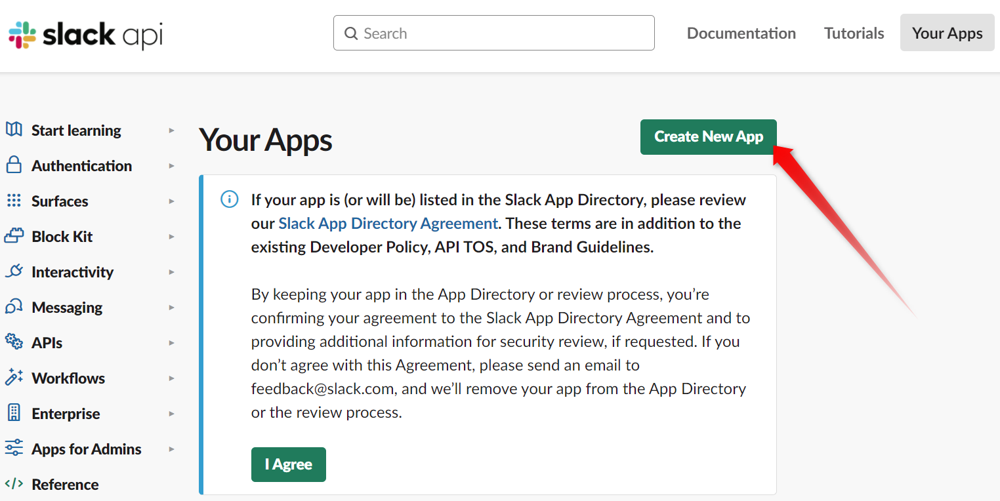
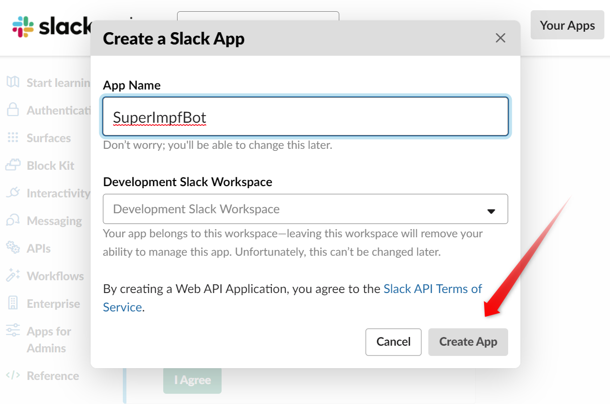
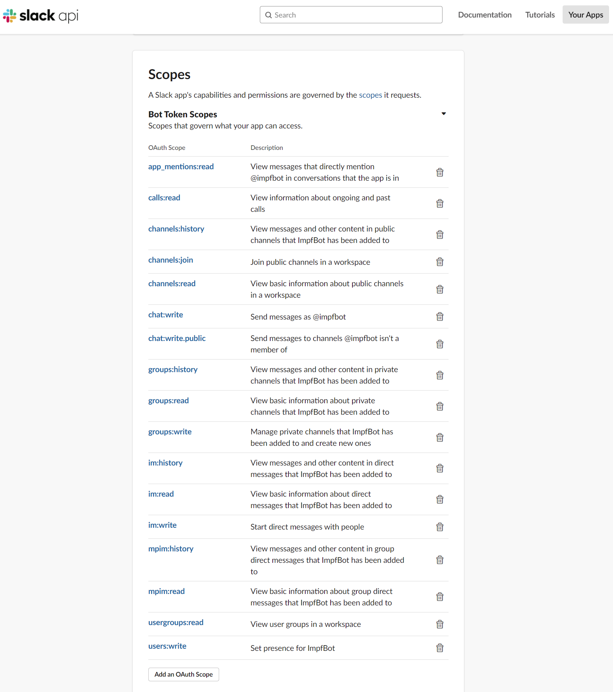

# 🤖🛠 SlackBot Setup

This is optional and can be skipped if you enter the SMS verification by your own. 
A requirement is a Slack workspace where you can
 1. create a channel (or use an existing to chat with your bot)
 2. create an additional custom app
 3. add your bot to the channel

To make this imp-bot more accessible for others, a good alternative for slack could be
[retrosheet](https://github.com/theapache64/retrosheet). This allows to use Google spreadsheets as data backend.

## Setup Slack

### 1. Create App
Open https://api.slack.com/apps/ and click _Create App_.

Give your new bot a name.


### 2. Add Scopes
Before installing the bot, you have to edit permissions. 
Open the app config and in main menu _OAuth & Permissions_.
Maybe a few of them are not needed.   
If you want to use the minimum, just run the bot in debug mode (`simplelogger.properties` with `defaultLogLevel=debug`).
Every api result will be logged - which also lists you missing permissions. 
All write permissions can be skipped if you only want to use the bot for notification.

These are the one I used:
 * app_mentions:read
 * calls:read
 * channels:history
 * channels:join
 * channels:read
 * chat:write
 * chat:write.public
 * groups:history
 * groups:read
 * groups:write
 * im:history
 * im:read
 * im:write
 * mpim:history
 * mpim:read
 * usergroups:read
 * users:write



### 3. Install App
Copy the `OAuth Token` from _Install App_ and set it the `config.properties` as `slackBotApiToken`.  
Then you are ready to install the app to your workspace.


### 4. Add Channel
You need the channel name and to read from it also its id. You can easily list all available channel with their ids
with the `main` in `SlackClient.kt` and `slackClient.listChannelIds()`.
Then fill them in channel properties in `config.properties` and set `slackEnabled = true`. 
It's possible to you the same channel for `slackBotChannel` and `slackBotChannelReadSmsName`.
The channel came starts with `#`, the id with `CE`.

```properties
slackBotChannel = #your-notification-channel
slackBotChannelReadSmsName = #your-send-channel
slackBotChannelReadSmsId = CE728N1PY
```

### 5. Add Bot to Channel
If you want to use the Slack bot only for notification you can skip this step. 
Otherwise, you have to add the bot to the channel where it should read your sms code.
This can be also done in the  `SlackClient.main` with the `slackClient.joinChannel("CE728N1PY")`
to join a specific channel. This step is only needed once.

To test your setup you can simply call the methods: `testConnection()`, `sendMessage(..)`, `findLasSmsCode(..)`. 